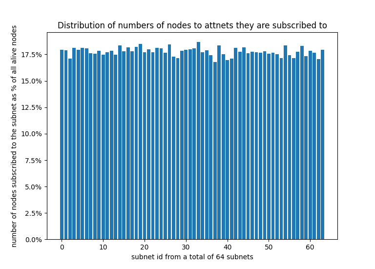

# discv5-crawl

## Usage

To build the project
```
make build
```
To run discv5-crawl
```
./bin/discv5-crawl
```
After you run discv5-crawl, you will see the log as follows.
```
2022/03/08 15:23:54 found unalive node		id=851bf2176004d975
2022/03/08 15:23:54 found alive node		id=6a70f87bee29daff
2022/03/08 15:23:55 found alive node		id=69a311c4f12c3dd2
2022/03/08 15:23:55 found alive node		id=6cb5a992ed2b2143
2022/03/08 15:23:55 found node with attnets	id=6cb5a992ed2b2143	attnets=ffffeaff7bffbdbf
2022/03/08 15:23:56 found unalive node		id=6c2e71f6bea30809
2022/03/08 15:23:56 found duplicated node	id=6cb5a992ed2b2143
```
You can see that, while it crawls, it outputs the log notifying what node id is
found and what kind of node is found.

The line with the text `found unalive node` indicates that it found a node
which has an ENR but we cannot connect to it. That is it's unalive.

The line with the text `found alive node` indicates that it found a node which
has an ENR and we can connect to it.

The line with the text `found duplicated node` indicates that it found a node
which we have seen as an alive node before.

The most important line is the line with the text `found node with attnets`.
It is a line indicating that it found a node which is alive and there is an
attnets attribute in its ENR. In addition, the line also tells what is the
value of the attnets attribute. In the log shown above,
it is `attnets=ffffeaff7bffbdbf`

## Custom bootstrap nodes

By default, discv5-crawl uses the same bootstrap nodes as Ethereum mainnet
which is used by go-ethereum.

However, if you want to use your own bootstrap nodes, you can do so by putting
the `-bootnodes` flag in the command line.
```
./bin/discv5-crawl -bootnodes="enr:-KG4QOtcP9X1FbIMOe17QNMKqDxCpm14jcX5tiOE4_TyMrFqbmhPZHK_ZPG2Gxb1GE2xdtodOfx9-cgvNtxnRyHEmC0ghGV0aDKQ9aX9QgAAAAD__________4JpZIJ2NIJpcIQDE8KdiXNlY3AyNTZrMaEDhpehBDbZjM_L9ek699Y7vhUJ-eAdMyQW_Fil522Y0fODdGNwgiMog3VkcIIjKA"
```

## Testing

To run the tests
```
make test
```

## Distribution of numbers of subscribed nodes to attnets

The value of the attnets attribute is a bitvector showing what subnet the node
is subscrbed to. We have a Python script to plot the distribution of numbers of
subscribed nodes to attnets at `scripts/plot.py`.

You can run the following commands to ploy the chart.
```
./bin/discv5-crawl 2>&1 | tee log.file
# wait until you think you have enough log lines to plot the chart
./scripts/plot.py log.file
```

The chart I got by previously running the commands above is shown below.

